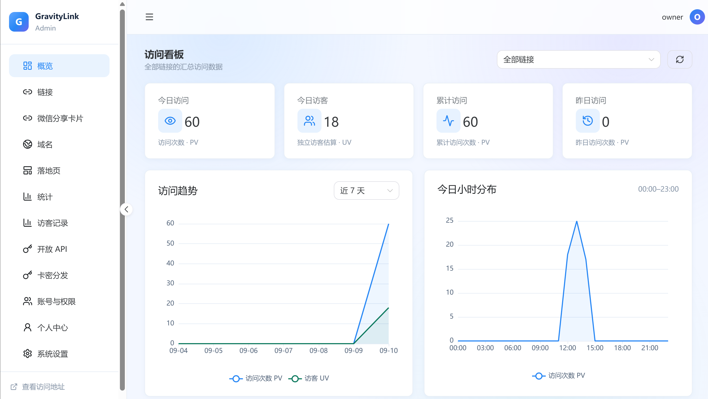
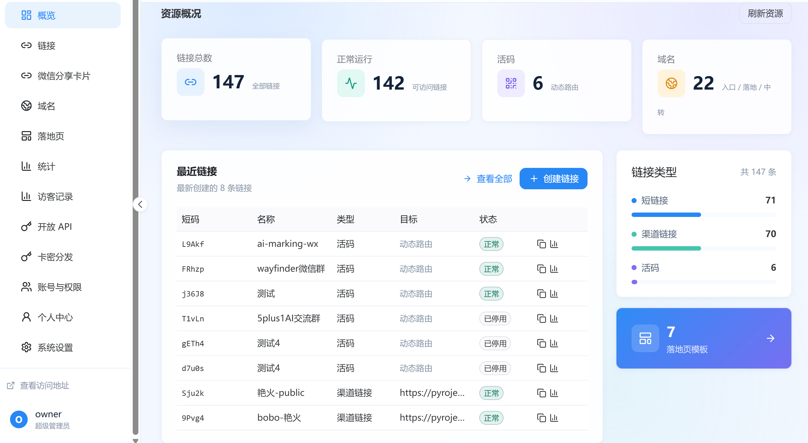

# GravityLink

GravityLink 是一个基于 Go + Vue 3 的短链接与活码管理系统，面向私有化部署。除短链接外，还覆盖渠道码、群活码、客服码、卡密分发、微信分享卡片、落地页、开放 API 与多维度访问统计。

English overview is included below.

  
  

## 功能

### 链接与活码

- **短链接**：自定义短码或 Base62 自动生成，支持禁用、过期、批量创建；修改短码后旧码自动跳转。
- **渠道码**：跳转时自动追加 UTM 参数，不覆盖目标 URL 已有参数。
- **群活码**：轮询 / 加权策略，按扫码上限、到期时间和启停状态自动切换目标；支持批量添加图片目标与计数重置。
- **客服码**：落地页展示在线状态徽章；按每周时段判断是否在线，支持微信号一键复制。
- **卡密分发**：项目化管理卡密，访客通过提取页领取；支持口令、频率限制、重复策略与提取记录。
- **访问限制**：可按 UA 规则拦截（如仅允许微信打开），并识别来源 APP。

### 域名与落地页

- **三类域名**：入口 / 中转 / 落地域名按 HTTP Host 自动分发。
- **落地页模板**：`liveqr`、`redirect_notice`、`custom`、`kf`、`kami` 五种模板，Go `html/template` 渲染，自定义 HTML 经过 sanitize。
- **公开页配置**：首页自动跳转、ICP / 公安备案号等可配置展示。

### 统计与运营

- **实时计数**：Redis 热路径计数，异步落盘 MySQL 聚合表。
- **多维统计**：PV / UV、按天 / 按小时、设备 / OS / 浏览器、地域（ip2region，镜像内置）。
- **访客记录**：支持按链接、日期、关键词筛选明细。
- **看板**：管理端 ECharts 趋势图、分布图与单链接快览。

### 分享与开放能力

- **微信分享卡片**：管理卡片标题、摘要、封面与目标；公开页配置 JS-SDK，支持公众号配置检测。
- **素材管理**：图片上传、素材库选择，供群码与分享卡片使用。
- **开放 API**：`/api/v1/open/short-links`，支持 Bearer Token 或 HMAC-SHA256 签名，可配置配额与 IP 白名单。

### 平台能力

- **认证**：Logto OIDC（PKCE）或本地 bcrypt 超级管理员；RBAC（super_admin / admin / user）。
- **初始化向导**：首次启动在管理端完成 MySQL / Redis / 身份配置，无需手改容器内文件。
- **部署**：单容器双端口（公网入口 + 管理端），支持外部 MySQL / Redis。
- **时区**：默认 Asia/Shanghai，容器与统计口径一致。

## 技术栈

| 层 | 技术 |
|----|------|
| 后端 | Go、Gin、GORM |
| 前端 | Vue 3、TypeScript、Vite、Naive UI、Pinia、ECharts |
| 存储 | MySQL 8、Redis 7 |
| 部署 | Docker / Docker Compose、预构建镜像 `5plus1/gravitylink` |
| 可选 | Logto（企业 SSO）；IP 地域库已随镜像内置 |

## 快速启动

### 方式一：本地构建（开发 / 全栈一键起）

```bash
# 复制并修改 MySQL 密码
cp deploy/.env.example deploy/.env

# 启动 MySQL + Redis + GravityLink
docker compose --env-file deploy/.env -f deploy/docker-compose.yml up --build -d
```

### 方式二：拉取预构建镜像（服务器推荐）

```bash
cp deploy/.env.example deploy/.env
docker compose --env-file deploy/.env -f deploy/docker-compose.server.yml up -d
```

### 方式三：外部已有 MySQL / Redis

```bash
docker compose -f deploy/docker-compose.external-db.yml up -d
```

初始化时在管理端填写实际连接信息。更完整的服务器部署步骤见 [deploy/DEPLOY.md](deploy/DEPLOY.md)。

### 默认端口

| 端口 | 用途 | 建议 |
|------|------|------|
| `18080` | 后端 API / 公网短链 / 落地页 | 对外开放 |
| `18081` | 管理端前端（含初始化向导） | 仅内网或加防火墙 / 反代 |

端口可通过 `APP_PORT` / `ADMIN_PORT` / `MYSQL_PORT` / `REDIS_PORT` 覆盖。

启动后访问：

- 健康检查：`http://127.0.0.1:18080/api/v1/health`
- 管理端：`http://127.0.0.1:18081`

## 首次初始化

MySQL / Redis 连接信息与认证方式**不需要提前写进配置文件**。首次打开管理端会进入初始化向导：

1. **数据服务**：填写 MySQL / Redis，先「测试连接」再进入下一步。
2. **管理员身份**：本地账号（bcrypt）或 Logto OIDC 二选一。
3. **确认启用**：填写公开访问地址，完成初始化并锁定 setup 接口。

配置写入 `CONFIG_FILE`（容器默认 `/data/gravitylink.json`），业务在当前进程内热启用，无需重启容器。

### Logto 回调地址

若使用 Logto，需在 SPA 应用中加入允许列表：

```text
https://admin.example.com/auth/callback
https://admin.example.com/setup/auth/callback
http://127.0.0.1:18081/auth/callback
http://127.0.0.1:18081/setup/auth/callback
```

## 访问短链接

管理端只是后台，不应直接对公网用户开放。公网用户访问的是入口 / 落地域名：

1. 在「域名」页添加 `entry` / `landing` / `transit` 域名。
2. 将 DNS 指向服务器，HTTPS 由你自己的反向代理终止。
3. 用户访问 `https://go.example.com/{code}`：
   - 无落地页 → `302` 到目标 URL
   - 有落地页 → 跳到 `https://page.example.com/{code}` 渲染

本地验证 Host 路由示例：

```bash
curl -I -H "Host: go.demo.localhost" http://127.0.0.1:18080/demo
```

落地页公开样式与脚本由 Go 二进制内嵌，托管在 `/assets/landing/*`。

## 生产部署建议

1. **改掉默认密码**：至少修改 `deploy/.env` 中的 `MYSQL_PASSWORD`。
2. **管理端不直接暴露公网**：`18081` 仅内网，或反代后加访问控制。
3. **TLS 与域名**：入口 / 落地域名反代到 `APP_PORT`，管理域名反代到 `ADMIN_PORT`。
4. **数据备份**：备份 MySQL 业务库与 Docker 卷 `gravitylink_data`（配置、素材）。
5. **地域解析**：镜像已内置 [ip2region](https://github.com/lionsoul2014/ip2region) IPv4 库，默认启用。

Nginx 反代示例与故障排查见 [deploy/DEPLOY.md](deploy/DEPLOY.md)。

## 开发验证

```bash
# 后端
cd backend
go test ./...
go build ./...

# 前端
cd ../frontend/admin
npm run type-check
npm test
npm run build

# 部署配置
docker compose -f deploy/docker-compose.yml config
```

## 旧版迁移

先将旧系统数据导出为标准 CSV，再执行迁移 CLI：

```bash
cd backend
go build ./cmd/migrate-legacy
./migrate-legacy -domains domains.csv -links links.csv -dry-run
./migrate-legacy -domains domains.csv -links links.csv
```

详见 [Docs/migration.md](Docs/migration.md)。

## 项目状态

当前处于 **Phase 8 收尾 + 旧版迁移兼容 + 服务器部署** 阶段。已实现短链 / 渠道码 / 群码 / 客服码 / 卡密 / 分享卡片 / 开放 API / 统计闭环与管理端产品化。

尚未迁移或规划中的能力：淘客模块、插件系统、部分群码并流与素材独立管理页等。功能边界以 [Docs/legacy-comparison-2026-09-07.md](Docs/legacy-comparison-2026-09-07.md) 与 `workspace/status.md` 为准。

## 文档

- [文档索引](Docs/README.md)
- [系统架构](Docs/architecture.md)
- [数据库模型](Docs/data-model.md)
- [API 设计](Docs/api-overview.md)
- [域名路由](Docs/domain-routing.md)
- [初始化向导](Docs/setup.md)
- [UI 设计系统](Docs/ui-design-system.md)
- [服务器部署](deploy/DEPLOY.md)

## English

GravityLink is a self-hosted Go + Vue 3 link management system for short links, campaign links, live QR routing, customer-service QR codes, card-code distribution, WeChat share cards, landing pages, open API, and visit analytics.

### Features

- Short links with custom or generated Base62 codes, bulk create, disable, expire, and code aliases.
- Campaign links with UTM injection that never overwrite existing query params.
- Live QR codes with round-robin / weighted targets, scan limits, and schedule-aware customer-service pages.
- Card-code (kami) distribution projects with password, quota, and issuance records.
- Entry / transit / landing domain routing by HTTP Host.
- Landing templates: liveqr, redirect_notice, custom, kf, kami.
- WeChat share cards with JS-SDK signing and optional official-account config checks.
- Open API for programmatic short-link creation (Bearer or HMAC-SHA256).
- Redis real-time counters flushed into MySQL analytics (PV/UV, hourly, device, geo via bundled ip2region).
- Logto OIDC or local bcrypt admin, RBAC, and a first-run setup wizard.

### Quick start

```bash
cp deploy/.env.example deploy/.env

# Local build
docker compose --env-file deploy/.env -f deploy/docker-compose.yml up --build -d

# Or prebuilt image
docker compose --env-file deploy/.env -f deploy/docker-compose.server.yml up -d
```

Open `http://127.0.0.1:18081` and finish the setup wizard. Default public port is `18080`.

### Development

```bash
cd backend && go test ./... && go build ./...
cd ../frontend/admin && npm run type-check && npm test && npm run build
```

### Migration

```bash
cd backend
go build ./cmd/migrate-legacy
./migrate-legacy -domains domains.csv -links links.csv -dry-run
./migrate-legacy -domains domains.csv -links links.csv
```

### Deployment notes

TLS termination and domain routing belong to your reverse proxy (Nginx, Caddy, etc.): forward entry/landing HTTPS traffic to `APP_PORT` and admin traffic to `ADMIN_PORT`. Keep the admin port off the public internet when possible. See [deploy/DEPLOY.md](deploy/DEPLOY.md).
